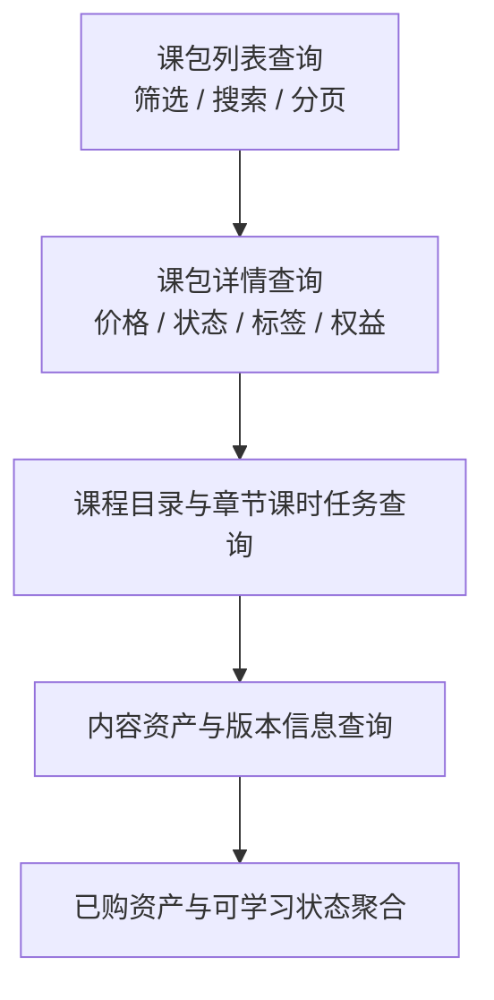

# Project ZENTRIX — API 开发计划

**文档目的**：基于 `design/api.md` 的 API 设计草案，拆解后端开发的执行顺序、阶段目标与验收点，作为 API 实现计划。

***

## 0. 当前差异速览

- 计划里的前八个阶段已经基本落地为可用 API，代码实现范围整体早于原始排期。
- `licenses` / `devices`、`progress`、`runs` / `submissions`、`admin`、`webhooks` 这些原本靠后的模块，已经在仓库中形成了完整控制器和配套服务。
- 当前更接近收尾阶段的工作是联调、状态字段校对、幂等验证和文档收敛，而不是继续扩展主干接口。

***

## 1. 计划原则

- 先打通认证、会话与当前用户能力，再进入业务接口。
- 先实现只读查询接口，再实现写入与状态变更接口。
- 先实现 Web 依赖的核心接口，再补齐 Desktop、管理与 webhook 能力。
- 先完成通用基础设施，再推进领域接口，避免局部接口先行导致重复改造。

***

## 2. 阶段一：基础能力与接口骨架

### 2.1 目标

- 确定 API 项目结构、路由分层与统一响应格式。
- 建立认证、会话、权限与错误处理的基础能力。
- 约定接口命名、分页格式、状态字段与错误码风格。

### 2.2 计划步骤

1. [x] 搭建 API 模块结构与路由前缀划分。
2. [x] 落实统一响应模型、分页模型和错误模型。
3. [x] 接入认证基础设施，打通注册、登录、退出与会话查询。
4. [x] 实现当前用户信息读取与基础鉴权守卫。
5. [x] 建立审计日志、请求标识与基础日志能力。

### 2.3 验收点

- 所有接口返回格式一致，错误码可区分业务失败与系统失败。
- 已登录与未登录状态能够被稳定识别。
- 当前用户相关接口可在 Web 端直接消费。

***

## 3. 阶段二：用户与个人中心

### 3.1 目标

- 支撑 Web 端的个人资料、安全设置与偏好设置页面。
- 提供会话管理、通知偏好与审计记录查询能力。

### 3.2 计划步骤

1. [x] 实现 `GET /api/me` 与资料展示字段。
2. [x] 实现资料修改、密码修改与偏好设置更新接口。
3. [x] 实现会话列表查询与单会话注销能力。
4. [x] 实现通知偏好读取与更新接口。
5. [x] 实现当前用户审计记录查询接口。

### 3.3 验收点

- Web 个人设置页可完整读写资料、安全与偏好信息。
- 会话注销后登录态能失效并被前端正确感知。

***

## 4. 阶段三：课包与内容查询

### 4.1 目标

- 支撑课包市场、课包详情和我的课包列表。
- 提供课程、章节、课时、任务与内容资源的只读查询接口。

### 4.2 计划步骤

1. [x] 实现课包列表查询接口，支持筛选、搜索与分页。
2. [x] 实现课包详情接口，返回价格、状态、标签与权益信息。
3. [x] 实现课程目录、章节、课时与任务查询接口。
4. [x] 实现内容资产与版本信息查询接口。
5. [x] 对接已购资产与可学习状态的聚合返回。

### 4.3 验收点

- Web 能展示课包市场、详情页和我的课包列表。
- 课包是否已购买、是否可学习、是否已下架等状态可直接读取。
- 课包、章节、课时、任务、资产与版本信息可以直接按只读接口拉取。
- 阶段三对应的接口路径、查询参数和返回重点与设计草案保持一致。

***

## 5. 阶段四：订单、支付与会员

### 5.1 目标

- 支撑购买课包、开通会员、查询订单与支付结果。
- 提供支付回调和订单状态流转能力。

### 5.2 计划步骤

1. [x] 实现商品查询接口，明确课包商品与会员商品的返回结构。
2. [x] 实现订单创建、订单列表、订单详情与取消订单接口。
3. [x] 实现继续支付与支付状态查询接口。
4. [x] 实现会员订阅查询、创建、续费与自动续费管理接口。
5. [x] 实现支付 webhook，完成订单与订阅状态同步。

### 5.3 验收点

- Web 可以完成下单、查看订单、继续支付与订阅查询。
- 支付回调到达后，订单和订阅状态能稳定落库并反映到前端。

***

## 6. 阶段五：授权与设备

### 6.1 目标

- 支撑 Desktop 授权状态展示、设备绑定和解绑。
- 提供授权历史和异常处理能力。

### 6.2 计划步骤

1. [x] 实现当前授权状态查询接口。
2. [x] 实现设备列表与设备详情接口。
3. [x] 实现设备绑定码生成与绑定确认接口。
4. [x] 实现解绑接口与解绑后的授权状态刷新。
5. [x] 实现授权事件列表与历史查询接口。

### 6.3 验收点

- Web 可以完成设备绑定与解绑。
- 授权状态、绑定数量和到期时间可被正确展示。

***

## 7. 阶段六：进度、成就与等级

### 7.1 目标

- 为 Web 控制台提供只读学习进度、成就和等级数据。
- 为 Desktop 进度上报提供事件写入接口。

### 7.2 计划步骤

1. [x] 实现学习进度总览接口。
2. [x] 实现课程、课时和任务维度的进度查询接口。
3. [x] 实现进度事件上报与聚合接口。
4. [x] 实现成就列表、用户成就、等级定义与等级进度查询接口。
5. [x] 对齐 Web 控制台的统计卡片、成就墙和进度明细展示字段。

### 7.3 验收点

- Web 能展示只读进度总览、成就和等级信息。
- Desktop 上报的进度能被 API 聚合为稳定状态。

***

## 8. 阶段七：运行、判题与沙箱

### 8.1 目标

- 支撑 Desktop 发起运行和提交请求。
- 记录运行日志、判题结果与沙箱任务状态。

### 8.2 计划步骤

1. [x] 实现运行请求创建与运行结果查询接口。
2. [x] 实现提交记录创建与提交记录查询接口。
3. [x] 实现运行日志与判题结果查询接口。
4. [x] 实现沙箱 webhook 事件接收接口。
5. [x] 将运行与判题数据与提交历史分离存储。

### 8.3 验收点

- Desktop 发起的运行和提交能被 API 正确接收和追踪。
- 用户可以查询到运行结果、判题结论和日志信息。

***

## 9. 阶段八：管理与运维

### 9.1 目标

- 为运营和管理角色提供课包、商品、功能开关和审计能力。
- 为后续第三方内容入驻和运营操作预留入口。

### 9.2 计划步骤

1. [x] 实现管理端课程与商品列表、创建和更新接口。
2. [x] 实现审计日志和功能开关查询接口。
3. [x] 实现外部集成客户端管理接口。
4. [x] 对敏感写操作补充权限校验与审计记录。

### 9.3 验收点

- 管理端能力与公共业务接口隔离清晰。
- 所有敏感变更都有可追溯审计记录。

***

## 10. 阶段九：联调与收尾

### 10.1 目标

- 完成 Web 端依赖接口的联调。
- 验证状态流转、异常分支和接口一致性。

### 10.2 计划步骤

1. [ ] 联调登录、个人中心、课包市场、订单、会员与授权接口。
2. [ ] 补齐前后端约定缺失的状态字段与错误码。
3. [ ] 校验 webhook、幂等和重复提交场景。
4. [ ] 检查分页、筛选、排序和空状态返回是否一致。
5. [ ] 根据联调结果收敛接口结构与文档说明。

### 10.3 验收点

- Web 端主要页面不再依赖未定义接口。
- 核心业务路径可稳定走通并返回预期状态。

***

## 11. 交付顺序建议

1. 基础能力与接口骨架
2. 用户与个人中心
3. 课包与内容查询
4. 订单、支付与会员
5. 授权与设备
6. 进度、成就与等级
7. 运行、判题与沙箱
8. 管理与运维
9. 联调与收尾

***

## 12. 计划边界

- 本计划只描述 API 的开发步骤，不涉及具体实现工时。
- 计划以 `design/api.md` 为主，必要时与数据库和认证方案同步调整。
- 若后续引入第三方内容、AI 辅助或更复杂的商业化能力，应另行补充独立步骤。
