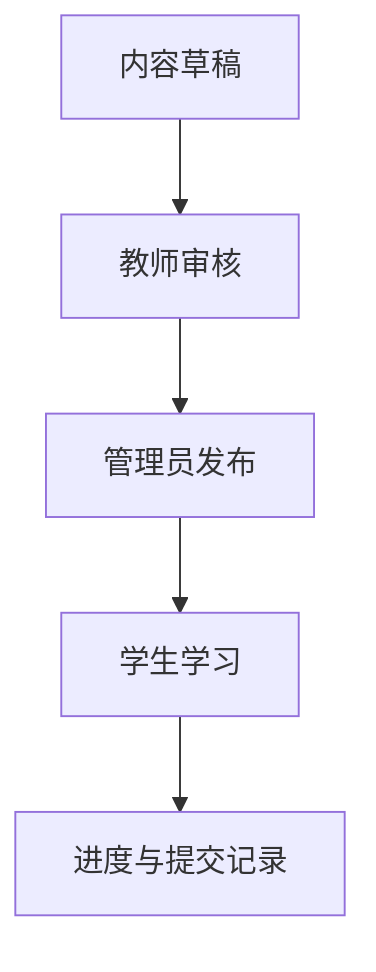

# 04 - 多租户三角色初期计划

**文档目的**：为课包内容系统补一版最初的多租户设计，明确学生、教师、管理员三类角色在内容、数据和权限上的边界。

**示例参考**：[`example/authoring/manifest.draft.json`](./example/authoring/manifest.draft.json) 里的 `tenantScope`、`packState`、`sourceOfTruth`

---

## 1. 初期目标

- 在不把系统一次性做重的前提下，先把租户边界立住。
- 让同一套课包内容可以被多个租户复用。
- 让学生、教师、管理员在内容编辑、学习和管理上职责清晰。
- 为后续课程市场、校区、机构、班级和组织层级扩展留口子。

---

## 2. 基本对象

建议最少保留以下对象：

- `tenant`：租户
- `tenantMember`：租户成员
- `role`：角色
- `contentPack`：课包
- `contentRelease`：课包发布版本
- `enrollment`：学生加入记录
- `teachingAssignment`：教师授课或管理指派

---

## 3. 三角色定义

### 学生

- 读取被授权的课包内容。
- 完成课程、测验和项目。
- 查看自己的学习进度和提交记录。
- 只能访问自己有权的租户和班级内容。

### 教师

- 查看并管理自己负责的课包或班级内容。
- 组织学习路径、布置测验、查看提交和批注。
- 读取教学统计，但不能越权修改租户级安全设置。
- 可以管理内容发布建议，但不一定拥有最终发布权。

### 管理员

- 管理租户、成员、角色和内容权限。
- 发布、下架、归档课包内容。
- 查看租户级审计和汇总数据。
- 维护内容同步、导入导出和权限边界。

---

## 4. 权限边界建议

- 学生只读课包内容，不直接编辑发布包。
- 教师可编辑教案态内容和题库草稿，但发布权限可选。
- 管理员拥有租户级发布和成员管理权限。
- 超级管理员如果存在，应属于平台级概念，不应混进租户日常角色里。

---

## 5. 多租户内容策略

建议区分三类内容范围：

- 平台共享内容：所有租户可见
- 租户专属内容：仅一个租户可见
- 班级或项目专属内容：仅特定成员可见

这样课包 Manifest 中的 `tenantScope` 才有明确语义。

---

## 6. 初期状态流

建议先实现最小可用状态流：

如果暂时没有教师审核环节，也可以先简化为“草稿 - 已发布 - 已归档”。

---

## 7. 数据与文件的关系

- 租户与角色建议留在数据库中管理。
- 课包内容、课程文件、测验模板建议留在文件系统或对象存储中。
- 数据库只保存索引、权限、发布记录、映射关系和运行态数据。
- 客户端读取内容时优先拿 Manifest，再按引用拉取细节文件。

---

## 8. 初期实施顺序

1. 先定义租户、成员、角色的最小表结构和权限语义。
2. 再把课包 Manifest 和租户可见性字段连起来。
3. 然后接入课程文件和测验模板的读路径。
4. 最后补充教师编辑和管理员发布流程。

---

## 9. 风险点

- 角色职责一开始如果混太多，会导致权限难以收敛。
- 内容文件如果过度自由，后续校验和同步会很难做。
- 如果不先定租户边界，内容共享和权限继承会很快失控。

---

## 10. 验收标准

- 三角色的最小权限范围可以被清晰描述。
- 同一课包可以在多个租户下复用而不复制内容本体。
- 教师和管理员的职责不会和学生学习态混淆。
- 内容文件和租户权限之间的职责边界明确。
